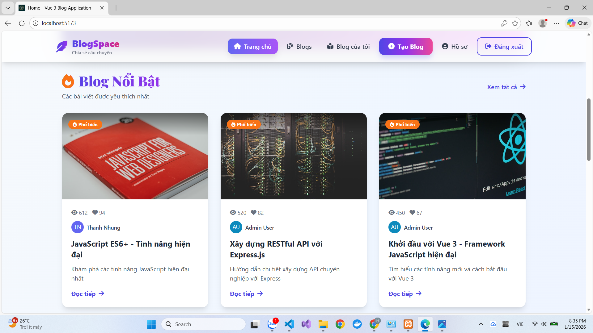

# 🌟 Vue 3 Blog Application

Ứng dụng Blog hiện đại, đầy đủ tính năng được xây dựng với Vue 3, Vite, Pinia, TailwindCSS và Node.js/Express.

## 🚀 Cách Chạy Dự Án

```bash
# Cài đặt dependencies
npm install

# Chạy cả Frontend & Backend
npm run dev
```

**Truy cập:**
- Frontend: http://localhost:5173
- Backend API: http://localhost:3000
- Database: phpMyAdmin (http://localhost/phpmyadmin)

## 📸 ẢNH DEMO / SCREENSHOTS

### 1. Trang Chủ / Home Page
.png)
*Giao diện trang chủ với danh sách bài viết mới nhất*

### 2. Dashboard
.png)
*Dashboard quản lý bài viết*

### 3. Blog List
.png)
*Danh sách blog với tính năng tìm kiếm và lọc*

### 4. Blog Detail
.png)
*Trang chi tiết bài viết*

### 5. Create/Edit Blog
.png)
*Form tạo và chỉnh sửa bài viết*

### 6. User Profile
.png)
*Trang thông tin người dùng*

### 7. Additional Screenshots

*Giao diện bổ sung*

### 8. Sample Images
<table>
  <tr>
    <td></td>
    <td></td>
  </tr>
  <tr>
    <td></td>
    <td></td>
  </tr>
</table>

