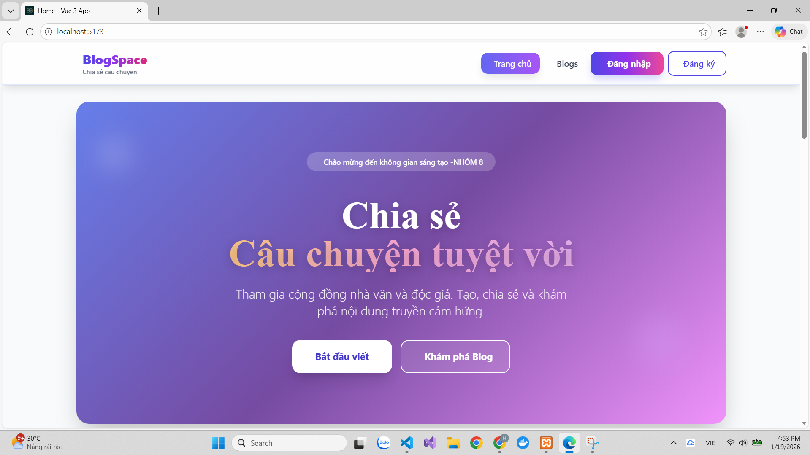
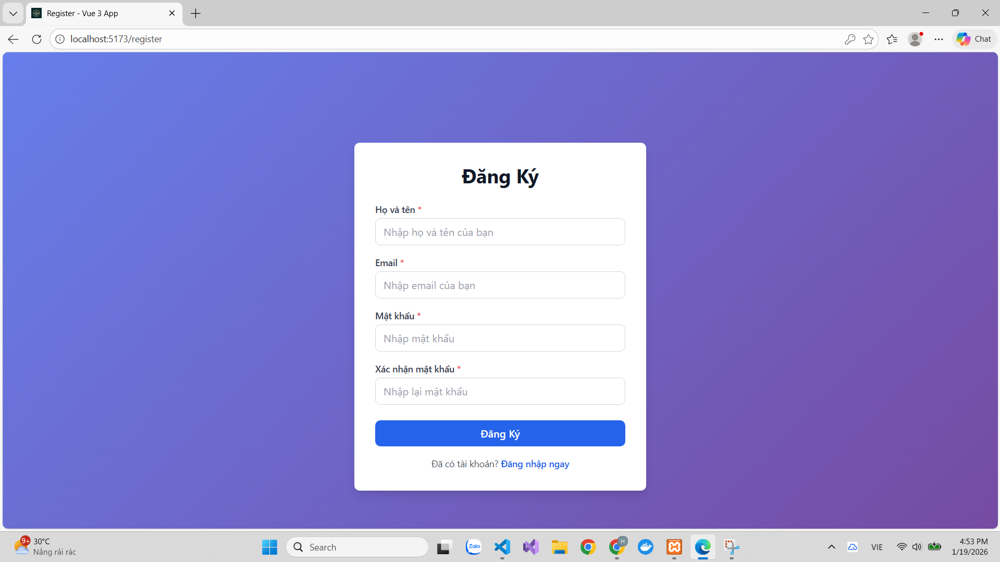
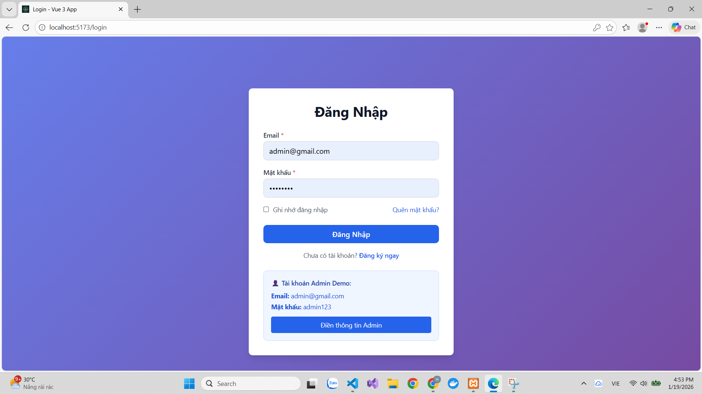
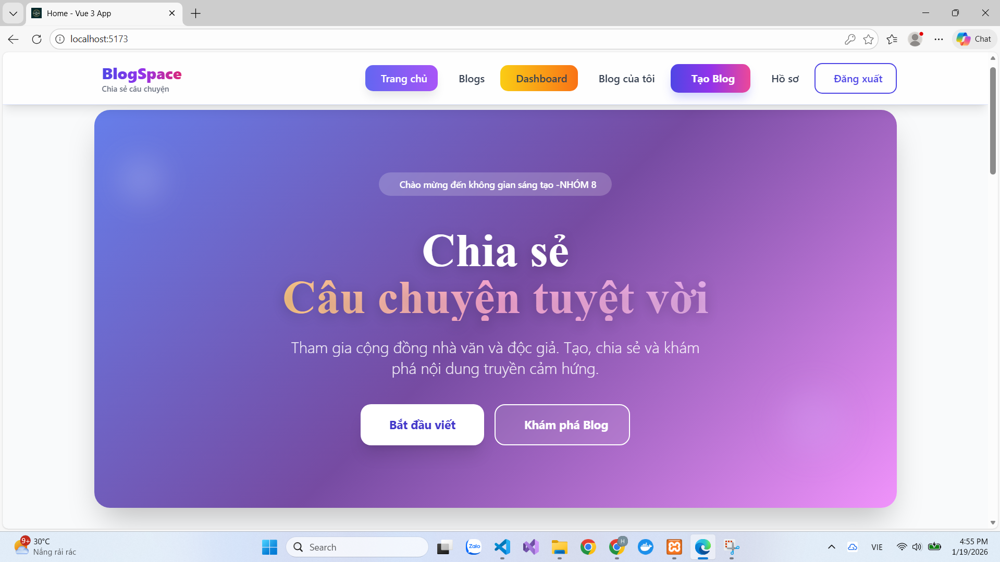
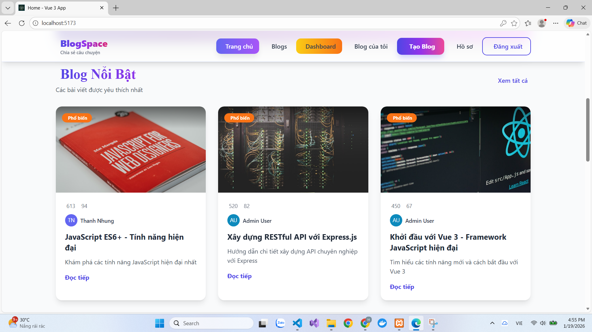

#  Vue 3 Blog Application

Ứng dụng Blog hiện đại, đầy đủ tính năng được xây dựng với Vue 3, Vite, Pinia, TailwindCSS và Node.js/Express.

## Cách Chạy Dự Án

```bash
# 1. Setup Database
Khởi động XAMPP và bật Apache, MySQL

Truy cập: http://localhost/phpmyadmin

Tạo database mới với tên: vue3_blog

Import file database.sql vào database vừa tạo

# 2. Cài đặt dependencies
npm install

# 3. Chạy cả Frontend & Backend
npm run dev
```

**Truy cập:**
- Frontend: http://localhost:5173
- Backend API: http://localhost:3000
- Database: phpMyAdmin (http://localhost/phpmyadmin)
## CẤU TRÚC THƯ MỤC CHI TIẾT

```
Elearning_4/
├── 📂 backend/                          # Backend API (Node.js + Express)
│   ├── 📂 config/
│   │   └── database.js                  # Cấu hình kết nối MySQL
│   ├── 📂 controllers/
│   │   ├── authController.js            # Controller: Xác thực (Login, Register, Logout)
│   │   ├── blogController.js            # Controller: Blog (CRUD, Upload, Search, Sort)
│   │   └── userController.js            # Controller: User (Profile, Update)
│   ├── 📂 middleware/
│   │   ├── auth.js                      # Middleware: JWT Authentication (Private API)
│   │   └── upload.js                    # Middleware: Multer Upload
│   ├── 📂 routes/
│   │   ├── auth.js                      # Routes: Auth (Public API)
│   │   ├── blogs.js                     # Routes: Blog (Public + Private API)
│   │   └── users.js                     # Routes: User (Private API)
│   ├── 📂 uploads/                      # Thư mục lưu file upload
│   ├── database.sql                     # File SQL khởi tạo database
│   ├── server.js                        # File khởi động server Express
│   ├── package.json                     # Dependencies Backend
│   └── .env                             # ✅ Biến môi trường Backend (QUAN TRỌNG)
│
├── 📂 src/                              # Frontend (Vue 3)
│   ├── 📂 api/                          # API Service Layer
│   │   ├── axiosInstance.js             # ✅ Cấu hình Axios (Request/Response Interceptor)
│   │   ├── auth.js                      # API: Authentication
│   │   ├── blog.js                      # API: Blog
│   │   └── user.js                      # API: User
│   ├── 📂 assets/                       # Tài nguyên tĩnh
│   │   ├── 📂 images/                   # Hình ảnh
│   │   └── 📂 icons/                    # Icons
│   ├── 📂 components/
│   │   ├── 📂 layout/
│   │   │   ├── Header.vue               # Component: Header
│   │   │   └── Footer.vue               # Component: Footer
│   │   └── 📂 ui/
│   │       ├── Button.vue               # Component: Button
│   │       ├── Input.vue                # Component: Input
│   │       ├── Modal.vue                # Component: Modal
│   │       └── ErrorState.vue           # Component: Error State
│   ├── 📂 composables/                  # Vue 3 Composition API
│   │   ├── useAuth.js                   # ✅ Composable: Authentication Logic
│   │   └── useForm.js                   # Composable: Form Validation
│   ├── 📂 directives/                   # Custom Directives
│   │   └── index.js                     # Export directives
│   ├── 📂 layouts/
│   │   ├── DefaultLayout.vue            # Layout: Trang chủ
│   │   └── AuthLayout.vue               # Layout: Login/Register
│   ├── 📂 router/
│   │   ├── index.js                     # Vue Router
│   │   ├── routes.js                    # Định nghĩa routes
│   │   └── guards.js                    # Navigation Guards (Auth)
│   ├── 📂 store/                        # Pinia Store (State Management)
│   │   ├── index.js                     # Store chính
│   │   ├── auth.js                      # Store: Authentication
│   │   ├── blog.js                      # Store: Blog
│   │   └── user.js                      # Store: User
│   ├── 📂 styles/
│   │   ├── main.css                     # CSS chính
│   │   ├── variables.scss               # SCSS Variables
│   │   ├── mixins.scss                  # SCSS Mixins
│   │   └── tailwind.css                 # TailwindCSS
│   ├── 📂 views/                        # Pages
│   │   ├── Home.vue                     # Trang chủ
│   │   ├── Login.vue                    # Đăng nhập
│   │   ├── Register.vue                 # Đăng ký
│   │   ├── ForgotPassword.vue           # Quên mật khẩu
│   │   ├── ResetPassword.vue            # Đặt lại mật khẩu
│   │   ├── Profile.vue                  # Hồ sơ người dùng
│   │   ├── ProfileEdit.vue              # Chỉnh sửa hồ sơ
│   │   ├── Dashboard.vue                # Dashboard
│   │   ├── BlogList.vue                 # Danh sách Blog
│   │   ├── BlogDetail.vue               # Chi tiết Blog
│   │   ├── BlogCreate.vue               # Tạo Blog
│   │   ├── BlogEdit.vue                 # Chỉnh sửa Blog
│   │   ├── MyBlogs.vue                  # Blog của tôi
│   │   └── NotFound.vue                 # 404 Not Found
│   ├── App.vue                          # Component gốc
│   └── main.js                          # Entry point
│
├── 📂 public/                           # File tĩnh (không qua build)
│   └── favicon.ico
│
├── .env                                 # ✅ Biến môi trường Frontend (QUAN TRỌNG)
├── .gitignore                           # Git ignore
├── index.html                           # HTML template
├── package.json                         # Dependencies Frontend
├── vite.config.js                       # ✅ Cấu hình Vite (Proxy, Alias)
├── tailwind.config.js                   # Cấu hình TailwindCSS
├── postcss.config.js                    # PostCSS config
├── README.md                            # ✅ Tài liệu dự án

```
## ẢNH DEMO / SCREENSHOTS

### 1. Trang Chủ / Home Page

### 2. Đăng Ký

### 3. Đăng nhập

### 4. Trang người dùng sau khi đăng nhập

### 5. Dashboard

### 6. Blog List



